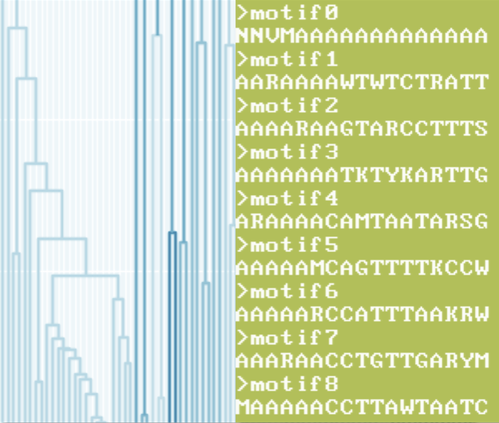

# **Vorpal**

A collection of scripts that implements the Vorpal RNA feature extraction algorithm.

To ensure the functionality of these scripts, it is strongly advised to use the included `vorpal.yml`
to reconstruct the conda environment for which the dependencies are known to fuction correctly. In newer versions of pandas, numpy, and scipy the implementation of sparse dataframes has changed and will break this implementation of the Vorpal. We plan to fix this at some point but, for now, the easiest thing to do is create a specific Vorpal conda environment for the workflow.

First, clone the library:

    git clone https://www.github.com/mriglobal/vorpal.git

Assuming you have conda installed already (in case you don't please go to https://docs.conda.io/en/latest/ for instructions on installation) create the Vorpal conda environment: `conda env create --file vorpal.yml`
Activate your environment: `conda activate vorpal`

You should be able to execute the scripts in the library now.

## Overview

1. kmercountouter_sparse.py

This script will take a specified reference sequence, `-r`, and use the length of that sequence to bin the sequences specified in the `--seqs` directory. Those that are within the length criteria of `-p` will proceed to canonical K-mer counting where K size is specified in `-k`. The ouput will be a pickled sparse dataframe object of shape K-mers x Sequence ID. This orientation is for convenience in the high-frequency filtering stage.

>     usage: kmercountouter_sparse.py [-h] -r R --seqs SEQS [-k [K]] [-p P]
>     
>     Kmer Counter for RNA viruses
>     
>     optional arguments:
>       -h, --help   show this help message and exit
>       -r R         Reference genome
>       --seqs SEQS  Folder for Sequences
>       -k [K]       K size for counting: default 18
>       -p P         Percent Variance in reference length for replicon binning
>

 2. hammingclusters_fast.py
 
This script will take the sparse dataframe output from `kmercountout_sparse.py` and perform hierarchical clustering on the resulting K-mers. There are many user parameters to specify. First, `-q` specifies the quantile for K-mer frequency cutoff to proceed to clustering. In other words, a .95 quantile means that only the top 5% of abundant K-mer will be clustered. The abundance calculation is defined in the manuscript. This parameter is used mostly as a tool to make calculation of the linkage function tractable given the memory requirements. The most important parameter regarding motif creation is `-n`, which specifies where the resulting tree should be cut to form clusters. The parameter is specified as average number of degenerate bases desired, and that number is converted to a fraction of the length of the K-mer size. Various additional arguments are for managing memory contraints. Memory mapping of the distance matrix with --temp allows for memory to be freed for the linkage calculation. Both the K-mer frequency counting and distance matrix calculations can been chunked as well using the `-c` and `--mem` arguments respectively.

>      usage: hammingclusters_fast.py [-h] -p P [-n N] [-q Q] [-c C] [--temp TEMP]
>                                    [--mem MEM]
>     
>     Create Degenerate Primers from Kmer Clusters
>     
>     optional arguments:   -h, --help   show this help message and exit  
>     -p P         Pickled Kmer Sparse DataFrame   
>     -n N         Average Number of Allowed Degenerate Bases   
>     -q Q         Quantile of clustered Kmers   
>     -c C         Number of chunks to split matrix into for count processing.
>                    Default 0   
>     --temp TEMP  Location of temp directory for memory mapped matrix. (Default:
>                    None)   
>     --mem MEM    Amount of memory allocated to process distance matrix chunks.
>                    (In MiB)

 3. referencemapping_mp.py
 
 This script uses a Biopython SeqUtils function to map the degenerate motifs fasta file, `-k`, resulting from `hammingclusters_fast.py`  to the concatenated sequences specified by `-r`. The resulting alignments (forward strand only) are output as a series of discrete BED format files for each unique sequence specified in `-r`, to the current working directory.
 

>      usage: referencemapping_mp.py [-h] -r R -k K [-t T]
>     
>     Mapping Degenerate Kmers to Reference Sequences
>     
>     optional arguments:   -h, --help  show this help message and exit   
>     -r R        Concatenated References Fasta   
>     -k K        Degenerate Kmers Fasta   
>     -t T        Number of threads. Default all.
> 
> 
> 
> Written with [StackEdit](https://stackedit.io/).

